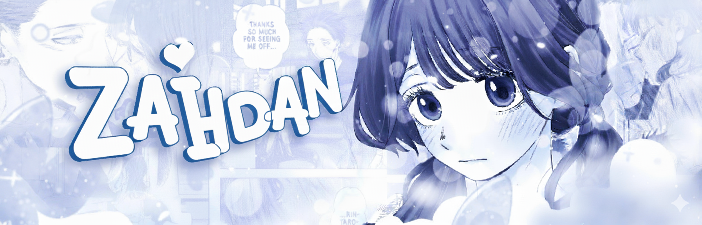
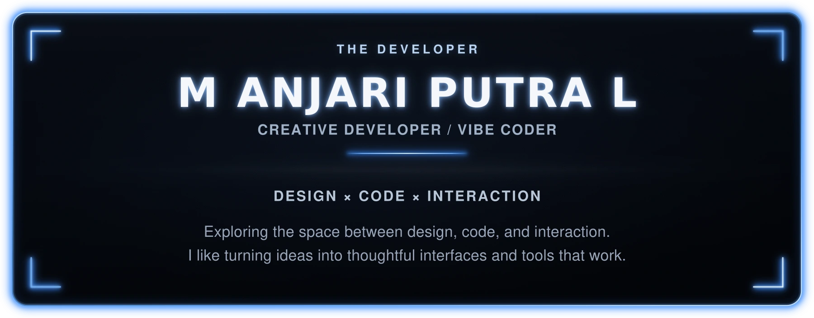
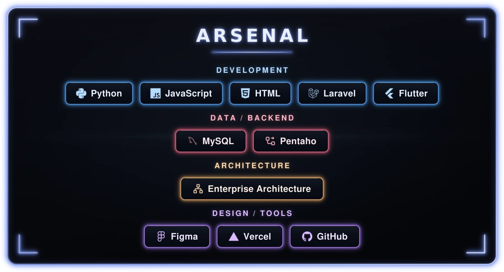
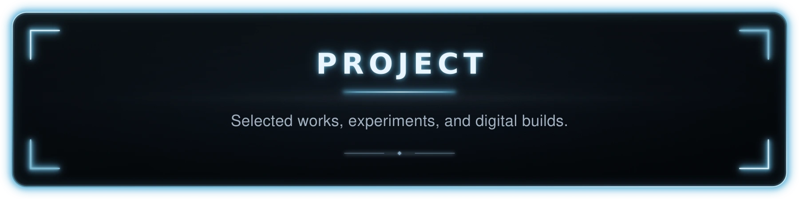

<!-- ZAHDANGG • GITHUB PROFILE -->
<!-- Public profile uses rasterized visual assets; SVG master sources are kept offline/private -->

  

 

<!-- THE DEVELOPER -->

  

<!-- ARSENAL -->

  

<!-- PROJECT -->

  

<table align="center" width="100%">
  <tr>
    <td width="50%" valign="top">

### Cinematic Portfolio
**Category:** Web Experience  
**Year:** 2026

Transition into an interactive portfolio.

**Stack:** `Next.js` `TypeScript` `GSAP` `WebGL`

    </td>
    <td width="50%" valign="top">

### Hero & Stack Lab
**Category:** Data Structures · Coursework  
**Year:** 2025

A Laravel project with a hero list, an item resource, and a Livewire stack interface for adding and removing values.

**Stack:** `Laravel` `Livewire` `Filament` `Docker`

    </td>
  </tr>
</table>

 

  

CRAFTED WITH INTENTION.

