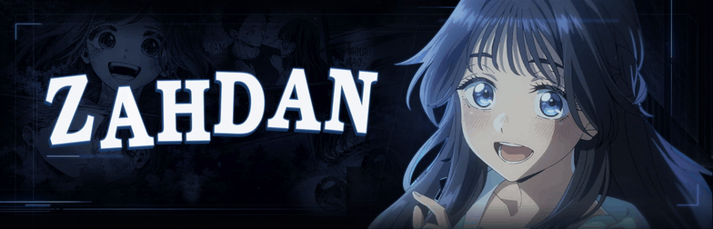

| CINEMATIC PORTFOLIO | HERO & STACK LAB |
| :--- | :--- |
| **Web Experience · 2026** | **Data Structures · 2025** |
| A motion-driven, cinematic portfolio with smooth interactions and detailed visual design. | A Laravel project featuring hero and item resources, plus an interactive Livewire stack. |
| `Next.js` · `TypeScript` · `GSAP` · `WebGL` | `Laravel` · `Livewire` · `Filament` · `Docker` |
| [**↗ Live Preview**](https://zahdan-cinematic-portfolio.vercel.app/) | [**↗ View Repository**](https://github.com/ZahdanGG/ProjectAkhir_StukDat) |

---

**CRAFTED WITH INTENTION.**

ZAHDAN · CREATIVE DEVELOPMENT

